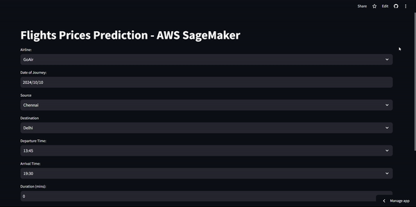

# Flight Price Prediction: End-to-End Machine Learning Project Using AWS SageMaker

## 🌐 Live Streamlit App
[Access the Flight Price Prediction App](https://flights-price-prediction-app-deployment-orwdbbtjcrxfoxrfbgv8dx.streamlit.app/)



## 📊 Overview
This repository hosts a Streamlit web application designed to predict flight ticket prices using machine learning models. Users can input various flight details—including airline, journey date, source, destination, and departure time—and receive a predicted ticket price. The application employs a pre-trained model with comprehensive preprocessing pipelines using Scikit-learn, Feature-engine, and a RandomForestRegressor for feature selection, with an XGBoost model for final price predictions.

## ✨ Features
- **User Inputs:** Easily select flight details such as airline, source, destination, departure and arrival times, duration, and total stops.
- **Preprocessing Pipelines:** Data transformations are seamlessly handled using Scikit-learn pipelines, including:
  - Rare label encoding and mean encoding for categorical variables
  - Custom feature engineering (e.g., source-destination mapping and time of day extraction)
  - Scaling features using techniques like StandardScaler and PowerTransformer
- **Model:** A pre-trained XGBoost model provides accurate flight price predictions based on user inputs.
- **Web Interface:** A user-friendly and interactive interface created with Streamlit.

## 🛠️ Dependencies
Before running the application, ensure you have the following packages installed:

```bash
pandas
numpy
scikit-learn
joblib
feature-engine
streamlit
xgboost
